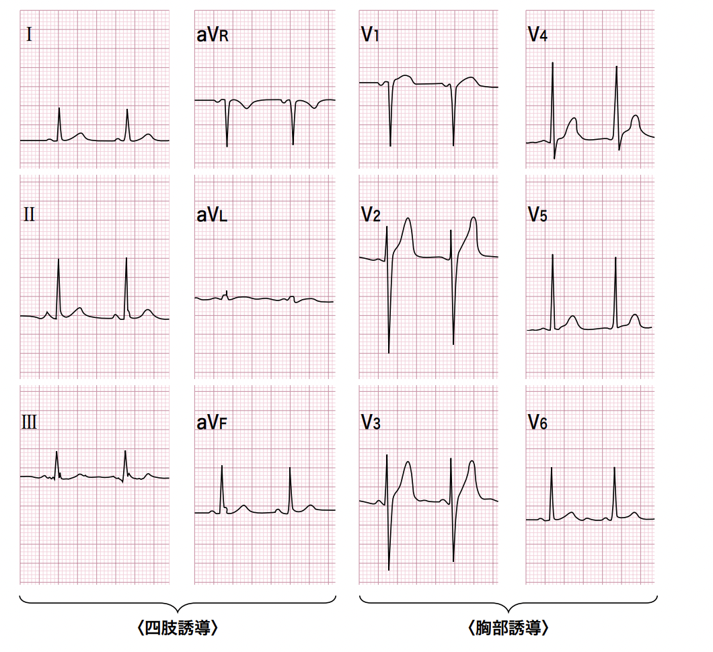

# 正常心電図
## BEFORE THAT... 
- 正常な心臓では、心室筋の興奮は、中隔左室側 → 中隔右室側 → 右室 → 左室 → 心尖部 → 心基部。
- TERMS
  - PR Interval : From the start of the P wave to the start of the QRS complex.
  - PR Segment : From the end of the P wave to the start of the QRS complex.
  - J Point :  The junction between the QRS complex and the ST segment.
  - QT Interval : From the start of the QRS complex to the end of the T wave.
  - QRS Interval : From the start to the end of the QRS complex.
  - ST segment : From the end o the QRS complex (J point) to the start of the T wave.  

## NORMAL VALUES
- Heart rate : 60-100bpm
- PR interval : 0.12s ~ 0.20s => 3 ~ 5 squares
- QRS interval : ≦ 0.12s
- QT interval : < half RR interval (♂ <0.40s, ♀ < 0.44s)
- P wave amplitude (in lead II) : ≦ 3mV
- P wave terminal negative deflection (in lead V1) : ≦ 1mV
- Q wave : < 0.04s (1/3 of R)

## NORMAL ECG
  
A mild increase in V1-V3 is acceptable.

## REFERENCES
- https://med.toaeiyo.co.jp/contents/ecg/index.html
- https://elentra.healthsci.queensu.ca/assets/modules/ECG/index.html